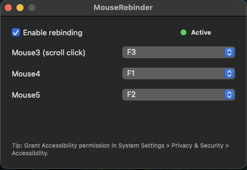

# 🖱️ MouseRebinder

MouseRebinder is a lightweight macOS utility that remaps extra mouse buttons to keyboard keys.

It supports:
- `Mouse3` (scroll wheel click / middle click)
- `Mouse4`
- `Mouse5`

Each mouse button can be mapped to one keyboard key, or set to `None`.



## 🪴 Features

- Simple native macOS UI (SwiftUI)
- Per-button mapping for Mouse3/Mouse4/Mouse5
- Persistent settings (`UserDefaults`)
- Global input handling through macOS event tap

## 🤔 How This Differs From Typical Remappers

Many remapping tools focus on keyboard-only triggers or treat mouse actions separately. MouseRebinder is specifically designed to fire mapped key presses directly from Mouse3/Mouse4/Mouse5 input events, so the mapped hotkey can still trigger while the mouse is actively moving.

## Supported Keys

- `A-Z`
- `0-9`
- `F1-F12`
- `Space`, `Return`, `Escape`, `Tab`
- Arrow keys

## 🧐 Why permissions are required

macOS blocks global input interception by default. MouseRebinder needs **Accessibility** permission to:
- observe global mouse button events
- send keyboard key events back to the system

Without this permission, remapping will not work.

## 📦 Installation

### Option 1: Download from GitHub Releases

1. Open the latest release.
2. Download either:
- `MouseRebinder-macos-binary.zip` (raw executable)
- `MouseRebinder.app.zip` (double-clickable app bundle)
- `MouseRebinder-<version>.pkg` (installer package for `/Applications`)
3. Unzip and run.

### Option 2: Build locally

```bash
make release
```

Run the built executable:

```bash
./.build/release/MouseRebinderApp
```

Or run in debug directly:

```bash
make run
```

## First Launch: Grant Accessibility Permission

1. Launch MouseRebinder once.
2. Open **System Settings** -> **Privacy & Security** -> **Accessibility**.
3. Enable permission for MouseRebinder (or your terminal if launched via `make run`).
4. Restart the app if remapping does not activate immediately.

## Configuration

1. Enable **Enable rebinding**.
2. Pick a target key for:
- `Mouse3 (scroll click)`
- `Mouse4`
- `Mouse5`
3. Set any mapping to `None` to keep that mouse button unchanged.

Configuration is saved automatically and restored on next launch.

## 📝 Notes

- Function keys may be handled by macOS media-key settings depending on your keyboard preferences.
- Unsigned binaries/apps/pkg installers may show a Gatekeeper warning on first launch/install.

## ☢️ Gaming / Anti-Cheat Disclaimer

Use this tool at your own risk in online games.

The repository owner does not guarantee that using this app will be considered safe by game rules, anti-cheat systems, or moderation policies, and does not guarantee you will not be warned, suspended, or banned.

For Tibia specifically, this tool maps one mouse button press to one keyboard key press, which should generally align better with typical one-input-to-one-input rules. However, there is still risk, and you are fully responsible for how you use it.

## 👩‍💻 Development

Requirements:
- macOS 13+
- Xcode command line tools / Swift toolchain

Build:

```bash
make build
```

## 📜 License

This project is licensed under the MIT License. See [LICENSE](LICENSE).

## ☺️ Authorship / AI Assistance

This project was created with significant AI assistance using OpenAI's GPT-5 Codex coding agent workflow. Human supervision, testing, and publishing decisions remain the responsibility of the repository owner.
